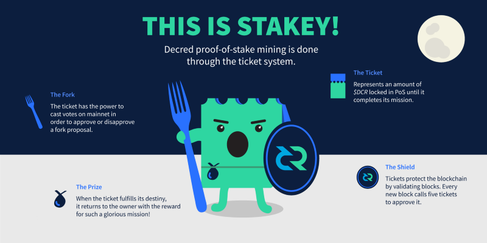
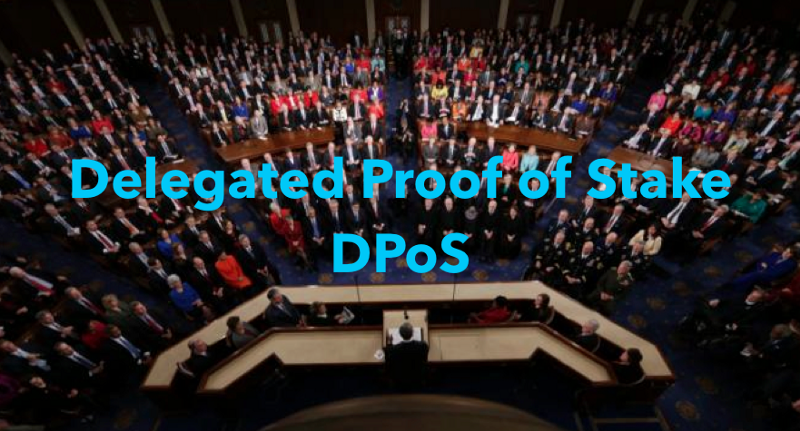

### 共识算法漫游指南（A Hitchhiker's Guide to Consensus Algorithms）
加密货币共识类型快速分类

莫慌。在每一种伟大的电子货币的背后，都有一个伟大的共识算法来支撑。
没有一种共识算法是完美的，但是每一种都有他们自己的优点。
在加密的世界里，共识的存在就是为了解决 *双花* 的问题。
接下来，简单介绍一些迄今为止最为流行的共识算法，从Blockchains到DAG之间的区别。

---

#### 工作量证明（PoW）- 元老级共识

**广泛应于与：** Bitcoin, Ethereum, Litecoin, Dogecoin(大多数其他加密货币)
**优点：** 我们知道他的工作量（译者：双关语，我们知道它运转正常
**缺点：** 低吞吐量；正在杀死地球（译者：浪费资源）

工作量证明是首个用于区块链的共识算法。由中本聪（Satoshi Nakamoto）设计，并应用于比特币区块链，我们能使用PoW还是要感谢在世界各地所看到的大规模采矿作业和能源的消耗。我们知道它运转正常（我们可以说它比其他大多数的共识运行的更好），但是，在这个游戏的这个阶段（译者：区块链技术萌芽阶段），它开始被认定是一个传统技术。甚至于以太坊也是从PoW迁移到更高效、更节能的PoS中。有了这么多新的方案，很难想象为什么一个新的区块链还会使用PoW。
在PoW中，*矿工* 解决困难的并且无意义的问题来创造区块。PoW运行在一个“赢得最长链”的系统上。因此，假设大多数矿工工作在同一条链上，那么增长速度最快的将会是最长的也是最值得信赖的链。因此，只要比特币中长的链超过50%的矿工都是诚实的，它就是安全的。

---

#### 权益证明（POS）- 链中的新生儿

**广泛应用于：** Decred，Ethereum（即将），Peercoin
**优点：** 攻击成本更昂贵；更非中心化；高效节能
**缺点：** 无成本投票
在PoS中，块的产生不是由矿工工作产生的，而是由*矿工们持有的*他们的权益（token）来“下注”哪一块是有效的。在分叉的情况下，矿工们花费他们的权益（token）来投票支持哪一个分叉。假设大部分人投票到正确的分支上，投票到错误分支的验证者将会在正确的分支上“失去他们的权益”。
关于权益证明常见的反对观点是“没有成本”的问题。值得注意的是，不同于PoW，验证者几乎不消耗计算能力去支持一条分叉，验证者可以投票到分叉的任何一条链上。PoS中的分叉也会比在PoW中更为常见，这也是人们担心会损害货币可信度的地方。

---

#### 授权证明（DPoS）- 选择你的验证节点

**广泛应用于：** Steemit， EOS， BitShares
**优点：** 交易费用低；可扩展；高效节能
**缺点：** 局部中心化
DPoS是Daniel Larimer的智慧结晶，世界上与PoS完全不同。在DPoS中，token持有者不会对块本身的有效性进行投票，而是投票选举代表来代表他们自己去验证。在DPoS系统中，通常会有21-100个选出的代表。代表会定期洗牌，并且会将顺序记载到他们的块中。因为拥有较少的代表，他们可以高效的管理自己，并能每一位代表创建指定时间窗口来推送他们的块。如果代表不断的失误或者发布无效交易，股东会将他们投票出去，并找个更好代表代替他。

---

#### 权威证明（PoA）- 相信知道的所有

**广泛应用于：** POA.Network, Ethereum Kovn testnet
**优点：** 高吞吐率；扩展性
**缺点：** 中心化系统
权威证明是一种交易由类似于系统”管理员“的批准用户来验证块的共识算法。这些账户从其他节点提供的真相来证实的。PoA具有很高的吞吐量，并优化了私有网络。但由于过于集中，你不太可能在公链中看到这种共识。

---

#### 权重证明（PoWeight）- 更大的就是更好的

**广泛应用于：** Algorand, Filecoin, Chia 
**优点：** 可定制；可扩展
**缺点：** 激励模式是个挑战
权重证明是基于Algorand一致性模型的共识算法分类中的常用分类。总体思路是，在PoS中，网络中你拥有的价值（token）代表了你”发现“下一个块的概率，在PoWeight系统中，使用了其他相对的加权值。具体的例子：Filecoin中的Proof-of-Spacetime会根绝你存储的IPFS数据进行加权。其他的系统可以包含的例如Proof-of-Reputation（声誉证明）之类的加权。

---

#### 拜占庭算法（BFT) - 围攻区块链

**广泛应用于：** Hyperleder, Stellar, Dispatch, 和 Ripple
**优点：** 高吞吐率；低消耗；可扩展
**缺点：** 半数信任
这是个经典的分布式计算问题，通常用拜占庭将军来解释。问题描述了几个拜占庭将军以及他们的军队，和被围攻的城的内容。他们必须一致决定是否进攻。如果将军们分别进攻，他们对城市的围困将会以失败告终。将军们按照距离分隔开，不得不用消息来进行沟通。一些加密货币协议使用了不同版本的BFT来达成共识，每种都有自己的有点和缺点。
**实用的拜占庭容错算法（PBFT)：** 其中一种优先解决方案叫做实用的拜占庭容错算法。Hyperledger Fabric目前正在实用，只设置很少（<20，之后可能会多一点）预先选定的将军执行PBFT，并表现出难以置信的高效。优点：高交易吞吐量；缺点：中心化/被许可。
**联邦拜占庭协议（FBA）：** FBA是另外一种拜占庭将军的解决办法，已经应用在Stellar和Ripple两种货币中。总体思想（heh，译者注：作者原文heh，可能想表达双关，将军的想法),是每一个将军负责自己的链，按照接收到真相排列消息。在Ripple中，将军们（产出 验证节点）是通过Ripple基金会预选出来的。在Stellar中，任何人都可以成为验证者，所以你可以选择你要相信的验证者。
由于难以置信的吞吐量，低交易成本和网络扩展性，我相信，FBA类的一致性算法是我们目前发现最好的分布式共识算法。

---

#### 有向无环图（DAGs）- 又名区块链杀手

**广泛应用于：** Ioa, Hashgraph, Raiblocks/Nano
**优点：** 网络扩展性；低消耗
**缺点：** 依赖实施

DAGs现在比 Vitalik's Tinder profile 更火爆。DAGs是不使用区块链结构，并且绝大多数是异步处理事务的一种共识形式。即使DAGs能够非常专业在每秒处理无限次交易，但它还是其他共识一样具有优势和劣势。

__Tangle:__ Tangle是由Iota使用的DAG共识实现。为了发送一条Iota交易，你需要验证你已经收到的以前的两条交易信息。合二为一，并传递下去的这种共识方式增强了交易的有效性，更多的交易被添加到Tangle中。因为共识是由交易确定的，理论上，如果有人能生成1/3的交易，那么他们就可以说服网络上其他人，他们的无效交易是有效的。直到有足够多的交易数量，使得再创造1/3的交易数据变得不可能。Iota是网络交易中“双重检查”的一种形式，并运行在一个叫做“The Coordinator”的中心节点上。Iota表示 The Coordinator像是系统的辅助轮一样，当Tangle足够大的时候就会被移除。

__Hashgraph:__ Hashgraph是由Leemon Baird开发的一种gossip-protocol共识算法。节点随机地与其他节点共享已知的交易记录，因此最终交易记录都会同步到其他的所有节点中。Hashgraph速度非常的快（每秒250,000+笔交易），但无法抵挡Sybil攻击。所以，Hashgraph是成为私有网络的很好的选择，你一定不会看到它像Ethereum或Dispatch这样的共有网络中实现这种算法。

__Block-lattice:__ Nano（以前被称为Raiblocks）运行在
一条叫做Block-lattice的链上。Block-lattice是一种结构，这种结构是让每一个用户（地址）都拥有他们自己的链，并且只有他们可以写入内容，每个人都拥有所有链的副本。所有的交易都被分解，并同时分配到一个发送者的发送块和一个接受组织的接接收块中。Block-lattice看起来简单到不能工作，但是它已经在外运行了一段时间了。独特的结构确实使得Block-lattice需要应对一些特殊的攻击，例如Penny-spend攻击，这种攻击是攻击者通过发送大量的、必须要追踪的、仅有少数价值的空钱包达到攻击手段。

__SPECTRE:__ *序列化的工作量证明事件：通过递归选举进行交易确认*，更广为人知的是SPECTRE,它是一个已经提出实用PoW和DAGs组合达成共识的比特币扩展方案。在SPECTRE中，区块被挖出后指向多个父区块，而不仅仅是一个，所以网络需要有能力每秒处理多个区块。即将被挖出来的块指向多个父区块，这些父区块能够证明其有效性。与PoW的"赢得最长链"相比，SPECTRE使用的更像是“赢得最多子区块”。SPECTRE还没有对外进行battle-tested，可能会出现新的攻击方式，但是，它看起来确实是潜在的能够巧妙的修复比特币的方式。

---

*我有错过你喜欢的算法么？喜欢这篇文章么？反馈到作者会让作者感动！由衷希望你们能获得我写这篇文章时我所得到的收获。十分感谢我的团队在Dispatch Labs（某个实验室）帮助我修改并筛选最好的公式算法！郑重感谢Hal Finney 🙏 并感谢所有的区块链建设者，让我们能走到这么远❤️*

*如果发现这篇文章对你有帮助，请👏或分享出去。Fllow me on Twitter for more insights twitter.com/ZaneWithSpoon*

原文：https://hackernoon.com/a-hitchhikers-guide-to-consensus-algorithms-d81aae3eb0e3

