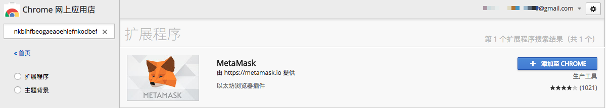
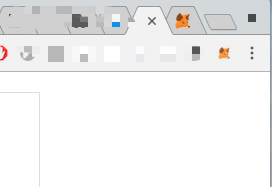
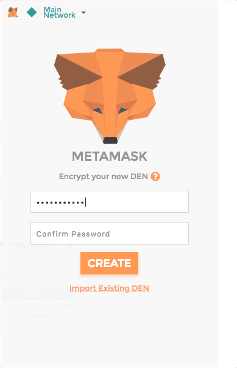
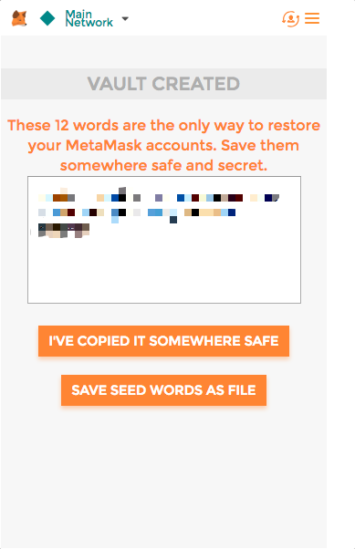
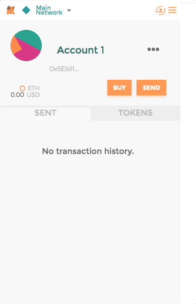

## 下载metaMask
本文使用 chrome 浏览器
* 复制如下[地址](https://chrome.google.com/webstore/search/nkbihfbeogaeaoehlefnkodbefgpgknn?hl=zh-CN)并在浏览器中的打开：
```
https://chrome.google.com/webstore/search/nkbihfbeogaeaoehlefnkodbefgpgknn?hl=zh-CN
```

* 搜索 MetaMask 应用，应用 ID 如下：
```
nkbihfbeogaeaoehlefnkodbefgpgknn
```

* 点击 **添加至CHROME** 



* 安装完成后会在 Chrome 右上角 显示一个_小狐狸_的图标



## 配置

* 接受协议要求

* 设置登录密码，用于后续登录



* **记住助记词** **很重要！用于以后恢复账户！！！**



* 配置完成



## 转账示例


eth_sendRawTransaction