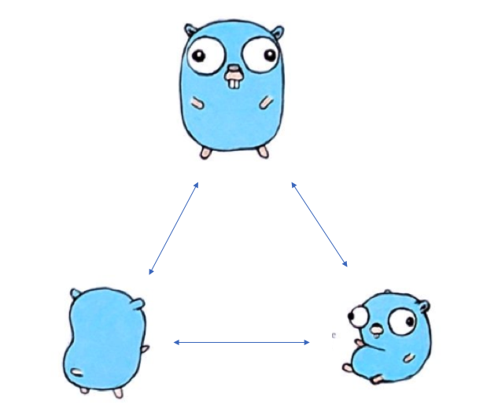

#### 使用Go语言编写简单的P2P区块链 ####



你已经加入到我们的Telegram群了吗？如果还没有，[点击加入](https://t.me/joinchat/FX6A7UThIZ1WOUNirDS_Ew) :-)
如果你在读这篇教程时遇到问题，你可以在群里联系我们。

我们的区块链教程目前非常的流行。这个系列的教程已经被浏览了成千上万次，并且有数百人加入到Telegram群里向我们反馈和咨询.

```go

```


原文地址：https://medium.com/coinmonks/code-a-simple-p2p-blockchain-in-go-46662601f417