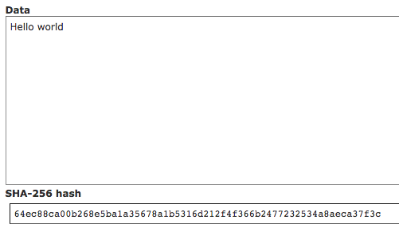
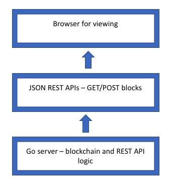
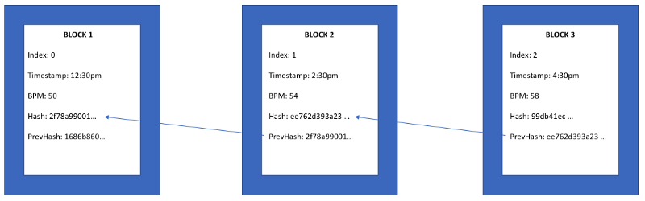

### 使用go语言编写属于你的挖矿算法 ###


如果你对下面的教程有任何问题或者建议，请添加到 [Telegram](https://t.me/joinchat/FX6A7UThIZ1WOUNirDS_Ew) 群中，可以咨询任何问题！

伴随着近期比特币和以太坊的挖矿热潮，让人容易感到怀疑，究竟是发生了什么。
对于刚刚来到这个领域的人来说，他们也许听过这个疯狂的事情，有人用GPU填满了仓库，
一个月内制造了价值数百万美元的加密货币。
那么，加密货币究竟是如何挖矿的？怎么运行？我能不能试着写一个属于自己的挖矿算法？

通过这篇文章，我们带你探索这些问题，并最终教会你如何编写一个属于你的挖矿算法。
我们将要使用的算法叫做**工作量证明**，它同时也是比特币和以太坊这两个最流行的加密货币的基础。
不用过于担心，我们会尽量简短的说明该算法是怎样工作的。

** 什么是加密货币的挖矿？ **

加密货币因其稀缺性导致其更有价值。如果任何人在任何时候都能随意生产比特币，
那么比特币作为货币的价值也就不大了（哎，等一下，美联储不就是这么做的么? :facepalm: ）。
比特币算法每隔十分钟向网络中计算成功的人发放一些比特币，并将在122年后全部挖取完成。
这种挖掘进度同样控制了通货膨胀，因为从一开始并不是释放全部的比特币。
随着时间推移，比特币的释放也越来越缓慢。

这是一个同其他做相同计算的节点竞争后，确定的一个赢家的过程，这个过程中，赢家会得到一些比特币。
这个过程叫做 _ 挖矿 _ ，因为这很像一个矿工花费时间去寻找到（并希望找到）一小块黄金的场景。

比特币挖矿算法强制参与者或者节点通过竞争的方式完成挖掘工作，防止比特币过快的增长。

** 那么，如何进行挖矿呢？ **

在google上去搜索“比特币是如何挖矿的？”，大部分的搜索结果页告诉你，
比特币挖矿就是一个节点（你或者你的电脑）解决一个非常难的数学问题。
尽管技术上确实这样的，但是简单的称运算过程为“数学“问题还真是有点让人觉得过于华而不实和迂腐。
对于如何进行挖矿还有一些有趣的理解。我们先要理解一点加密原理和哈希原来，然后再来理解如何挖矿。

** 一段关于加密哈希的简单介绍 **

_ 单向加密 _ 是将人类能识别的语言，例如”hello world“，通过一个方法（例如 某个数学原理）
转换成我们不能拼读内容。这些方法（或者算法）的性质和复杂性各不相同。算法越复杂，反向推算越困难。
因此，加密算法在用户密码，军用代码方面更有安全实用性。

让我们看一个关于 SHA-256 的例子，这是一个比较流行的算法。在这个网站（[hashing website](http://www.xorbin.com/tools/sha256-hash-calculator))能够方便
的得到 SHA-256 哈希结果。让我们 哈希 ”hello world“，看看能得到什么：



#### 背景介绍完毕，我们开始编码吧！ ####

架构



** 包的导入 **

让我们有标准引入开始吧。实用如下命令获取将要导入的包`go get `

`github.com/davecgh/go-spew/spew`使得在终端打印出来的内容更友好

`github.com/gorilla/mux`一个支持并发的网络服务框架

`github.com/joho/godotenv` 可以通过项目根目录中的`.env`读取环境变量

我们先在项目的根目录创建一个名字为`.env`文件，稍后会用到。在文件中添加一行`ADDR=8080`

在项目根目录中创建`main.go`文件，并定义和引用包：

```go

package main

import (
        "crypto/sha256"
        "encoding/hex"
        "encoding/json"
        "fmt"
        "io"
        "log"
        "net/http"
        "os"
        "strconv"
        "strings"
        "sync"
        "time"

        "github.com/davecgh/go-spew/spew"
        "github.com/gorilla/mux"
        "github.com/joho/godotenv"
)
```
如果你之前了解我们之前的文章，你应该还记得下面这个图。



** web server **

** Basic blockchain functions **

#### Proof of Work ####

#### 下一步 ####